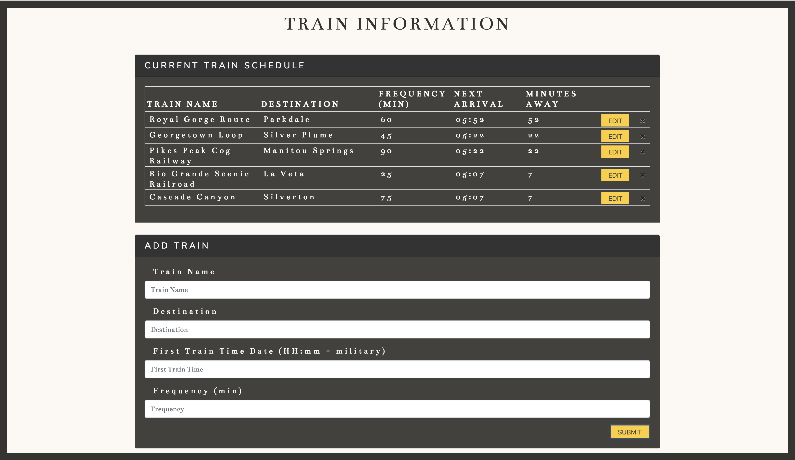

### Overview

A train schedule app that incorporates Firebase to host arrival and departure data.  This website provides up-to-date information about various trains, specifically their arrival times and how many minutes remain until they arrive at their station.

- 'Minutes Away' auto updates once a minute.
- Add new trains.
- Edit train information.
- Delete a train.

## Live Site
-  https://bnkfick.github.io/Train-Scheduler/

### Technology used

- Firebase
- Moment.js
- Jquery
- JavaScript
- HTML
- CSS
- Bootstrap

